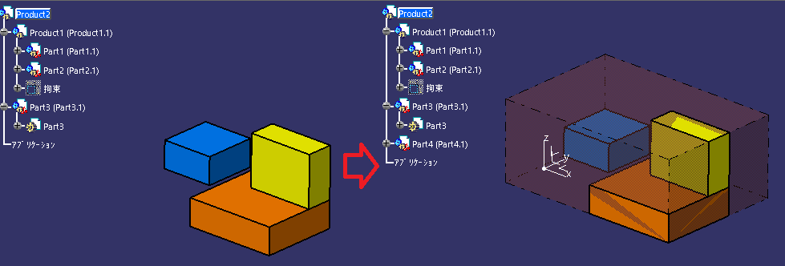

**GetMinimumBox_Product**

Dassault Systèmes社 ソフト <b>"CATIA V5-6" </b> のCATVBAマクロです。

## 特徴
選択されたプロダクトの表示されたボディを元に、MinimumBoxを作成します。

## 設置
'GetMinBox_Product.bas'を任意のVBAプロジェクトにインポートして下さい。
又、本マクロはCATVBA用自作ライブラリ'KCL'が必要です。
同一のVBAプロジェクトに[こちら](https://github.com/kantoku-code/KCL)にある'KCL.bas'
をインポートしてください。

## 使用
エントリーポイントの'CATMain'を呼び出し、任意のプロダクトを呼び出してください。

## 動作
以下の環境にて確認。
+ CATIA V5-6 Release2018
+ Windows10 64bit Pro

## ライセンス
+ MIT